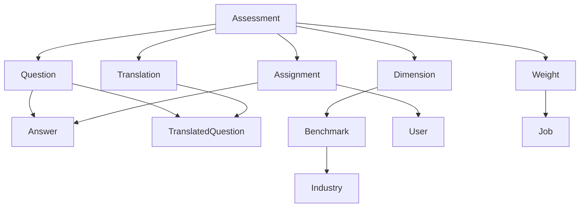

# Assessment Data Model & Export Guide

## Overview

This document provides a comprehensive understanding of the Talent Assessment System's data model, focusing on assessment relationships and how to design data export APIs for sharing and duplicating assessments across different systems and technology stacks.

## Core Assessment Data Model


### 1. Assessment Entity

The `Assessment` is the central entity that represents a complete psychological assessment or test battery.

**Key Attributes:**
```php
class Assessment extends Model
{
    protected $fillable = [
        'id',                    // Unique identifier
        'name',                  // Assessment name/title
        'description',           // Assessment description
        'logo',                  // Logo image path
        'background',            // Background image path
        'paginate',              // Whether to paginate questions
        'items_per_page',        // Questions per page
        'translation',           // Multi-language support flag
        'language',              // Default language
        'whitelabel',            // White-label branding flag
        'company_labeled_for',   // Company-specific branding
        'timed',                 // Whether assessment is timed
        'time_limit',            // Time limit in minutes
        'use_custom_fields',     // Custom field support
        'custom_fields',         // Serialized custom field data
        'target',                // Target audience/group
        'last_modified'          // Last modification timestamp
    ];
}
```

**Database Schema:**
```sql
assessments table:
- id (primary key, auto-increment)
- user_id (foreign key to users table)
- name (text)
- description (text)
- logo (text)
- background (text)
- paginate (boolean, nullable)
- items_per_page (integer, nullable)
- translation (boolean, nullable)
- language (text, nullable)
- whitelabel (boolean, nullable)
- company_labeled_for (text, nullable)
- timed (boolean, nullable)
- time_limit (integer, nullable)
- use_custom_fields (boolean, nullable)
- custom_fields (text, serialized, nullable)
- target (text, nullable)
- created_at, updated_at (timestamps)
- last_modified (timestamp)
```

### 2. Question Entity

Questions are the individual test items within an assessment.

**Key Attributes:**
```php
class Question extends Model
{
    protected $fillable = [
        'id',              // Unique identifier
        'content',         // Question text/content
        'number',          // Question order/sequence
        'type',            // Question type (1-11)
        'dimension_id',    // Associated dimension
        'anchors',         // Serialized answer options/scoring
        'practice'         // Practice question flag
    ];
}
```

**Question Types:**
```php
public static function types()
{
    return [
        1 => ['name' => 'Multiple Choice', 'slug' => 'choice'],
        2 => ['name' => 'Description', 'slug' => 'desc'],
        3 => ['name' => 'Text Input', 'slug' => 'input'],
        4 => ['name' => 'Letter Sequence', 'slug' => 'ls'],
        5 => ['name' => 'Math Equation', 'slug' => 'eq'],
        6 => ['name' => 'Math and Letters', 'slug' => 'eqls'],
        7 => ['name' => 'Square Sequence', 'slug' => 'sq'],
        8 => ['name' => 'Symmetry', 'slug' => 'sy'],
        9 => ['name' => 'Symmetry Squares', 'slug' => 'sysq'],
        10 => ['name' => 'Instructions', 'slug' => 'instruct'],
        11 => ['name' => 'Slider', 'slug' => 'slider']
    ];
}
```

**Database Schema:**
```sql
questions table:
- id (primary key, auto-increment)
- content (text)
- assessment_id (foreign key to assessments table)
- number (unsigned integer)
- type (unsigned integer)
- dimension_id (unsigned integer, nullable)
- anchors (text, serialized)
- practice (boolean, nullable)
- created_at, updated_at (timestamps)
```

### 3. Dimension Entity

Dimensions represent categories or factors that questions are grouped under for scoring and analysis.

**Key Attributes:**
```php
class Dimension extends Model
{
    protected $fillable = [
        'name',           // Dimension name
        'parent',         // Parent dimension ID (0 for top-level)
        'code',           // Dimension code/abbreviation
        'assessment_id'   // Associated assessment
    ];
}
```

**Database Schema:**
```sql
dimensions table:
- id (primary key, auto-increment)
- name (text)
- parent (unsigned integer, default 0)
- code (text)
- assessment_id (foreign key to assessments table, nullable)
- created_at, updated_at (timestamps)
```

### 4. Answer Entity

Answers represent user responses to individual questions during assessment completion.

**Key Attributes:**
```php
class Answer extends Model
{
    protected $fillable = [
        'assignment_id',  // Associated assignment
        'question_id',    // Associated question
        'user_id',        // User who provided answer
        'value',          // Answer value/content
        'time'            // Time taken to answer
    ];
}
```

**Database Schema:**
```sql
answers table:
- id (primary key, auto-increment)
- assignment_id (foreign key to assignments table)
- question_id (foreign key to questions table)
- user_id (foreign key to users table)
- value (text)
- created_at, updated_at (timestamps)
- time (timestamp, nullable)
```

### 5. Assignment Entity

Assignments represent individual instances of assessment completion by users.

**Key Attributes:**
```php
class Assignment extends Model
{
    protected $fillable = [
        'id',              // Unique identifier
        'user_id',         // User taking assessment
        'assessment_id',   // Assessment being taken
        'completed',       // Completion status
        'custom_fields',   // Serialized custom field data
        'started_at',      // Start timestamp
        'completed_at',    // Completion timestamp
        'expires',         // Expiration timestamp
        'whitelabel',      // White-label branding
        'target_id',       // Target user ID
        'reminder',        // Reminder settings
        'next_reminder',   // Next reminder timestamp
        'reminder_frequency', // Reminder frequency
        'job_id',          // Associated job
        'short_name'       // Short identifier
    ];
}
```

**Database Schema:**
```sql
assignments table:
- id (primary key, auto-increment)
- user_id (foreign key to users table)
- assessment_id (foreign key to assessments table)
- url (string)
- completed (boolean)
- custom_fields (text, serialized, nullable)
- started_at (timestamp, nullable)
- completed_at (timestamp, nullable)
- expires (timestamp)
- whitelabel (boolean, nullable)
- target_id (foreign key to users table, nullable)
- reminder (boolean, nullable)
- next_reminder (timestamp, nullable)
- reminder_frequency (string, nullable)
- job_id (foreign key to jobs table, nullable)
- short_name (string, nullable)
- created_at, updated_at (timestamps)
```

### 6. Translation Entity

Translations provide multi-language support for assessments.

**Key Attributes:**
```php
class Translation extends Model
{
    protected $fillable = [
        'id',              // Unique identifier
        'name',            // Translated assessment name
        'description',     // Translated assessment description
        'assessment_id',   // Associated assessment
        'language_id'      // Language identifier
    ];
}
```

**Database Schema:**
```sql
translations table:
- id (primary key, auto-increment)
- name (text)
- description (text)
- assessment_id (foreign key to assessments table)
- language_id (foreign key to languages table)
- created_at, updated_at (timestamps)
```

### 7. TranslatedQuestion Entity

Translated questions provide question content in different languages.

**Key Attributes:**
```php
class TranslatedQuestion extends Model
{
    protected $fillable = [
        'question_id',     // Associated question
        'content',         // Translated question content
        'anchors'          // Translated answer options
    ];
}
```

**Database Schema:**
```sql
translated_questions table:
- id (primary key, auto-increment)
- question_id (foreign key to questions table)
- content (text)
- anchors (text, serialized)
- created_at, updated_at (timestamps)
```

### 8. Weight Entity

Weights provide custom scoring configurations for assessments based on job requirements.

**Key Attributes:**
```php
class Weight extends Model
{
    protected $fillable = [
        'assessment_id',   // Associated assessment
        'weights',         // Serialized weight values
        'divisions'        // Serialized division values
    ];
}
```

**Database Schema:**
```sql
weights table:
- id (primary key, auto-increment)
- job_id (foreign key to jobs table)
- assessment_id (foreign key to assessments table)
- weights (text, serialized)
- divisions (text, serialized)
- created_at, updated_at (timestamps)
```

### 9. Benchmark Entity

Benchmarks provide industry-specific scoring standards for dimensions.

**Key Attributes:**
```php
class Benchmark extends Model
{
    protected $fillable = [
        'industry_id',     // Associated industry
        'dimension_id',    // Associated dimension
        'value'            // Benchmark value
    ];
}
```

**Database Schema:**
```sql
benchmarks table:
- id (primary key, auto-increment)
- industry_id (foreign key to industries table)
- dimension_id (foreign key to dimensions table)
- value (decimal)
- created_at, updated_at (timestamps)
```

## Entity Relationships

### Primary Relationships



### Detailed Relationship Mapping

#### Assessment → Question (One-to-Many)
```php
// Assessment model
public function questions()
{
    return $this->hasMany('App\Question');
}

// Question model
public function assessment()
{
    return $this->belongsTo('App\Assessment');
}
```

#### Assessment → Dimension (One-to-Many)
```php
// Assessment model
public function dimensions()
{
    return $this->hasMany('App\Dimension');
}

// Dimension model
public function assessment()
{
    return $this->belongsTo('App\Assessment');
}
```

#### Assessment → Translation (One-to-Many)
```php
// Assessment model
public function translations()
{
    return $this->hasMany('App\Translation');
}

// Translation model
public function assessment()
{
    return $this->belongsTo('App\Assessment');
}
```

#### Assessment → Weight (One-to-Many)
```php
// Assessment model
public function weights()
{
    return $this->hasMany('App\Weight');
}

// Weight model
public function assessment()
{
    return $this->belongsTo('App\Assessment');
}
```

#### Assessment → Assignment (One-to-Many)
```php
// Assessment model
public function getAssignmentsForUser($id)
{
    return Assignment::where([
        'assessment_id' => $this->id,
        'user_id' => $id
    ])->get();
}

// Assignment model
public function assessment()
{
    return Assessment::find($this->assessment_id);
}
```

#### Question → Answer (One-to-Many)
```php
// Question model
public function answerFromAssignment($assignment_id)
{
    $assignment = Assignment::find($assignment_id);
    if (!$assignment) return null;
    
    return $assignment->answers()->where('question_id', $this->id)->first();
}

// Answer model
public function question()
{
    return $this->belongsTo('App\Question');
}
```

#### Question → Dimension (Many-to-One)
```php
// Question model
public function dimension()
{
    return Dimension::find($this->dimension_id);
}

// Dimension model
public function questions()
{
    // Through assessment relationship
    return $this->assessment->questions()->where('dimension_id', $this->id);
}
```

#### Translation → TranslatedQuestion (One-to-Many)
```php
// Translation model
public function questions()
{
    return $this->hasMany('App\TranslatedQuestion');
}

// TranslatedQuestion model
public function translation()
{
    return $this->belongsTo('App\Translation');
}
```

#### Dimension → Benchmark (One-to-Many)
```php
// Dimension model
public function benchmarks()
{
    return $this->hasMany('App\Benchmark');
}

// Benchmark model
public function dimension()
{
    return $this->belongsTo('App\Dimension');
}
```

#### User → Assessment (One-to-Many)
```php
// User model
public function assessments()
{
    return $this->hasMany('App\Assessment');
}

// Assessment model
public function user()
{
    return $this->belongsTo('App\User');
}
```

## Data Export API Design

### 1. Assessment Export Endpoint

**Endpoint:** `GET /api/assessments/{id}/export`

**Purpose:** Export complete assessment data for duplication in other systems

**Response Structure:**
```json
{
  "assessment": {
    "id": 123,
    "name": "Personality Assessment",
    "description": "Comprehensive personality evaluation",
    "logo": "path/to/logo.png",
    "background": "path/to/background.png",
    "paginate": true,
    "items_per_page": 10,
    "translation": true,
    "language": "en",
    "whitelabel": false,
    "timed": true,
    "time_limit": 60,
    "use_custom_fields": false,
    "custom_fields": null,
    "target": "General",
    "last_modified": "2024-01-15T10:30:00Z",
    "created_at": "2024-01-01T00:00:00Z",
    "updated_at": "2024-01-15T10:30:00Z"
  },
  "dimensions": [
    {
      "id": 1,
      "name": "Extraversion",
      "parent": 0,
      "code": "EXT",
      "assessment_id": 123,
      "created_at": "2024-01-01T00:00:00Z",
      "updated_at": "2024-01-01T00:00:00Z"
    },
    {
      "id": 2,
      "name": "Introversion",
      "parent": 0,
      "code": "INT",
      "assessment_id": 123,
      "created_at": "2024-01-01T00:00:00Z",
      "updated_at": "2024-01-01T00:00:00Z"
    }
  ],
  "questions": [
    {
      "id": 1,
      "content": "I enjoy being around large groups of people",
      "number": 1,
      "type": 1,
      "dimension_id": 1,
      "anchors": [
        {
          "tag": "Strongly Disagree",
          "value": 1
        },
        {
          "tag": "Disagree",
          "value": 2
        },
        {
          "tag": "Neutral",
          "value": 3
        },
        {
          "tag": "Agree",
          "value": 4
        },
        {
          "tag": "Strongly Agree",
          "value": 5
        }
      ],
      "practice": false,
      "created_at": "2024-01-01T00:00:00Z",
      "updated_at": "2024-01-01T00:00:00Z"
    }
  ],
  "translations": [
    {
      "id": 1,
      "name": "Evaluación de Personalidad",
      "description": "Evaluación integral de personalidad",
      "assessment_id": 123,
      "language_id": 2,
      "created_at": "2024-01-01T00:00:00Z",
      "updated_at": "2024-01-01T00:00:00Z",
      "questions": [
        {
          "question_id": 1,
          "content": "Disfruto estar rodeado de grandes grupos de personas",
          "anchors": [
            {
              "tag": "Totalmente en Desacuerdo",
              "value": 1
            },
            {
              "tag": "En Desacuerdo",
              "value": 2
            },
            {
              "tag": "Neutral",
              "value": 3
            },
            {
              "tag": "De Acuerdo",
              "value": 4
            },
            {
              "tag": "Totalmente de Acuerdo",
              "value": 5
            }
          ]
        }
      ]
    }
  ],
  "weights": [
    {
      "id": 1,
      "assessment_id": 123,
      "job_id": 456,
      "weights": {
        "EXT": 0.3,
        "INT": 0.7
      },
      "divisions": {
        "EXT": 0.4,
        "INT": 0.6
      },
      "created_at": "2024-01-01T00:00:00Z",
      "updated_at": "2024-01-01T00:00:00Z"
    }
  ],
  "benchmarks": [
    {
      "id": 1,
      "industry_id": 1,
      "dimension_id": 1,
      "value": 3.5,
      "created_at": "2024-01-01T00:00:00Z",
      "updated_at": "2024-01-01T00:00:00Z"
    }
  ],
  "metadata": {
    "export_version": "1.0",
    "exported_at": "2024-01-15T10:30:00Z",
    "system_version": "Laravel 5.1",
    "total_questions": 50,
    "total_dimensions": 5,
    "supported_languages": ["en", "es", "fr"],
    "question_types": [1, 2, 3, 10, 11]
  }
}
```

### 2. Assessment Import Endpoint

**Endpoint:** `POST /api/assessments/import`

**Purpose:** Import assessment data from external systems

**Request Structure:**
```json
{
  "assessment": {
    "name": "Imported Assessment",
    "description": "Assessment imported from external system",
    "logo": "path/to/logo.png",
    "background": "path/to/background.png",
    "paginate": true,
    "items_per_page": 10,
    "translation": true,
    "language": "en",
    "whitelabel": false,
    "timed": true,
    "time_limit": 60,
    "use_custom_fields": false,
    "custom_fields": null,
    "target": "General"
  },
  "dimensions": [...],
  "questions": [...],
  "translations": [...],
  "weights": [...],
  "benchmarks": [...],
  "metadata": {
    "source_system": "External System Name",
    "import_version": "1.0",
    "imported_at": "2024-01-15T10:30:00Z"
  }
}
```

**Response Structure:**
```json
{
  "success": true,
  "assessment_id": 124,
  "imported_entities": {
    "dimensions": 5,
    "questions": 50,
    "translations": 3,
    "weights": 2,
    "benchmarks": 5
  },
  "warnings": [
    "Question type 7 not supported in this system",
    "Dimension 'XYZ' has no parent dimension"
  ],
  "errors": []
}
```

### 3. Assessment Template Endpoint

**Endpoint:** `GET /api/assessments/templates`

**Purpose:** List available assessment templates for quick creation

**Response Structure:**
```json
{
  "templates": [
    {
      "id": "personality_basic",
      "name": "Basic Personality Assessment",
      "description": "Standard 5-factor personality assessment",
      "category": "personality",
      "estimated_time": 30,
      "question_count": 50,
      "dimension_count": 5,
      "supported_languages": ["en", "es"],
      "preview_url": "/api/assessments/templates/personality_basic/preview"
    },
    {
      "id": "cognitive_basic",
      "name": "Basic Cognitive Assessment",
      "description": "Standard cognitive ability assessment",
      "category": "cognitive",
      "estimated_time": 45,
      "question_count": 60,
      "dimension_count": 4,
      "supported_languages": ["en"],
      "preview_url": "/api/assessments/templates/cognitive_basic/preview"
    }
  ]
}
```

## Implementation Guidelines

### 1. Data Validation

**Required Fields:**
- Assessment: `name`, `description`
- Question: `content`, `number`, `type`, `assessment_id`
- Dimension: `name`, `code`, `assessment_id`

**Data Integrity Checks:**
- Question numbers must be unique within an assessment
- Dimension codes must be unique within an assessment
- Question types must be valid (1-11)
- Parent dimensions must exist before child dimensions
- Translation language IDs must be valid

### 2. Serialization Handling

**PHP Serialization:**
```php
// Export
$anchors = serialize($question->anchors);
$customFields = serialize($assessment->custom_fields);

// Import
$anchors = unserialize($importedData['anchors']);
$customFields = unserialize($importedData['custom_fields']);
```

**JSON Alternative:**
```php
// Export
$anchors = json_encode($question->anchors);
$customFields = json_encode($assessment->custom_fields);

// Import
$anchors = json_decode($importedData['anchors'], true);
$customFields = json_decode($importedData['custom_fields'], true);
```

### 3. Error Handling

**Common Import Errors:**
- Invalid question types
- Missing parent dimensions
- Duplicate question numbers
- Invalid language codes
- Malformed serialized data

**Error Response Format:**
```json
{
  "success": false,
  "errors": [
    {
      "entity": "question",
      "entity_id": 15,
      "field": "type",
      "value": 99,
      "message": "Invalid question type. Must be 1-11."
    }
  ],
  "warnings": [...],
  "partial_import": {
    "assessment_id": 124,
    "imported_questions": 45,
    "failed_questions": 5
  }
}
```

### 4. Security Considerations

**Authentication:**
- API key or OAuth2 token required
- Rate limiting on import/export endpoints
- Audit logging for all import/export operations

**Data Sanitization:**
- HTML content filtering
- SQL injection prevention
- File path validation for images

**Access Control:**
- User must have permission to export/import assessments
- Client isolation for multi-tenant systems
- Assessment ownership verification

## Cross-System Compatibility

### 1. Technology Stack Independence

**Data Format:**
- Use JSON for data exchange
- Avoid PHP-specific serialization in exports
- Provide clear data type specifications

**Question Type Mapping:**
```json
{
  "question_type_mapping": {
    "multiple_choice": 1,
    "description": 2,
    "text_input": 3,
    "letter_sequence": 4,
    "math_equation": 5,
    "math_and_letters": 6,
    "square_sequence": 7,
    "symmetry": 8,
    "symmetry_squares": 9,
    "instructions": 10,
    "slider": 11
  }
}
```

### 2. Version Compatibility

**API Versioning:**
- Include API version in endpoint URLs
- Maintain backward compatibility
- Document breaking changes

**Data Versioning:**
- Include export version in metadata
- Handle version-specific import logic
- Provide migration scripts for older versions

### 3. Extensibility

**Custom Fields:**
- Support for additional assessment properties
- Extensible question types
- Plugin architecture for custom scoring

**Integration Points:**
- Webhook support for real-time updates
- Event-driven architecture
- Standardized error codes and messages

## Testing and Validation

### 1. Export Validation

**Data Completeness:**
- All required fields present
- Relationship integrity maintained
- Serialized data properly formatted

**Content Validation:**
- Question content properly escaped
- Image paths valid
- Language codes standardized

### 2. Import Validation

**Data Integrity:**
- Foreign key relationships valid
- Unique constraints satisfied
- Data types correct

**Business Logic:**
- Question numbering sequential
- Dimension hierarchy valid
- Scoring weights normalized

### 3. Round-Trip Testing

**Export → Import → Export:**
- Data consistency maintained
- No data loss or corruption
- Performance acceptable

**Cross-System Testing:**
- Different technology stacks
- Various data sizes
- Multiple language support

## Conclusion

This assessment data model provides a robust foundation for sharing and duplicating assessments across different systems. The key to successful implementation is:

1. **Clear Data Structure**: Well-defined entities with explicit relationships
2. **Flexible Export Format**: JSON-based data exchange with comprehensive metadata
3. **Robust Validation**: Comprehensive error checking and data integrity validation
4. **Extensible Design**: Support for custom fields and future enhancements
5. **Cross-Platform Compatibility**: Technology-agnostic data formats and APIs

By following these guidelines, you can create a system that allows assessments to be seamlessly shared between different platforms while maintaining data integrity and supporting the full range of assessment functionality.
